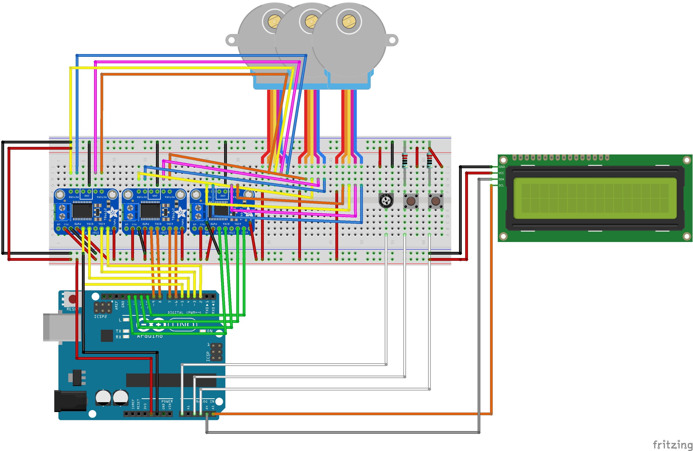
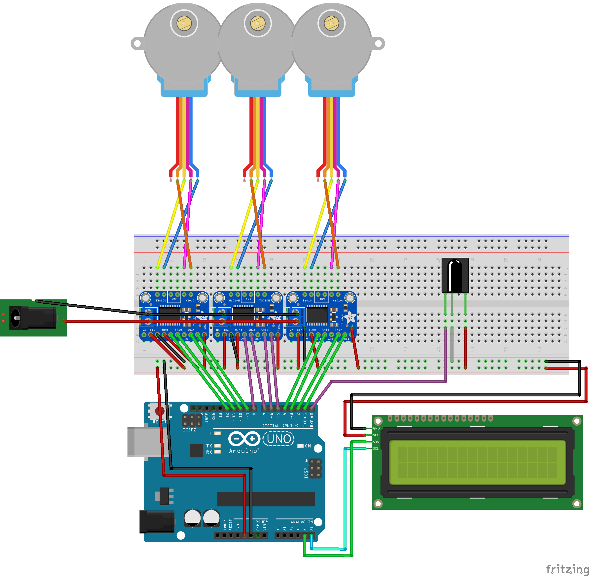
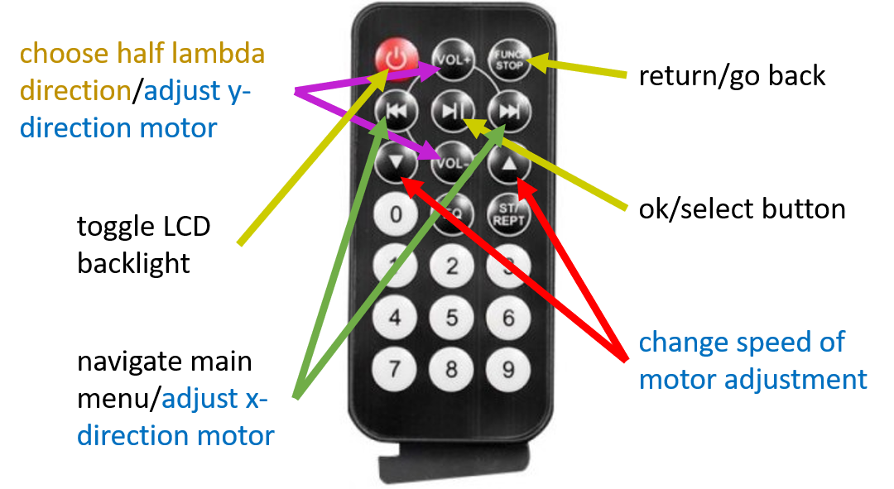
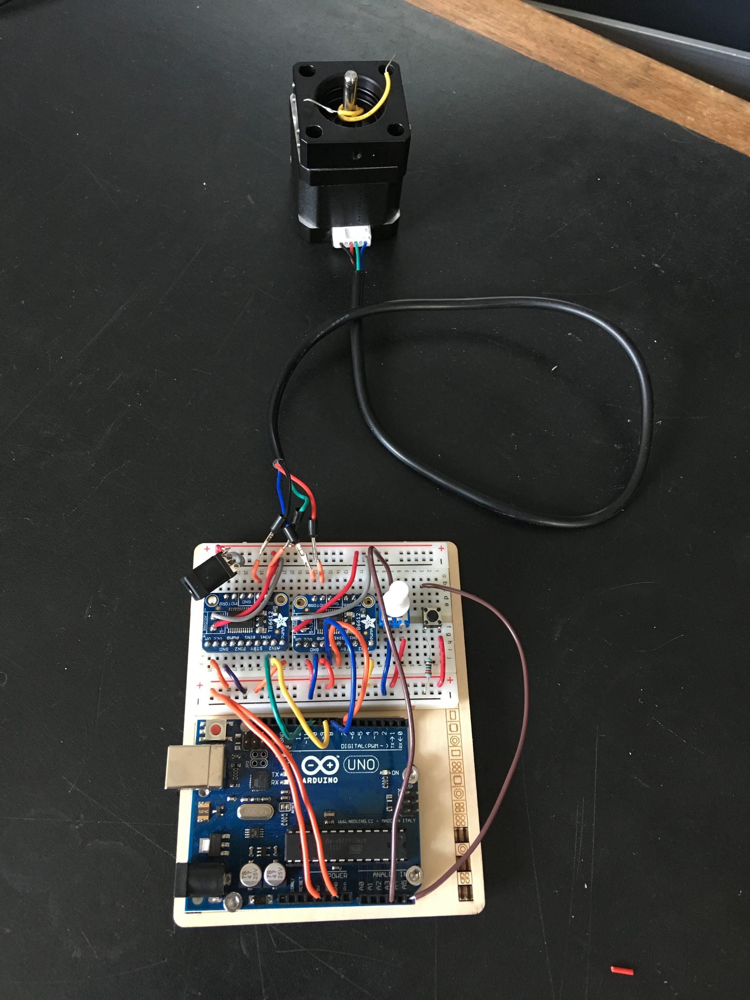

# Arduino Codes (Jason)

## LCD Menu and Stepper Control (IR Receiver)

---
### Libraries used;

**Default:** *(pre-installed with Arduino IDE)*

`<Wire.h>`  
`<Stepper.h>`

**External:** *(installed via library manager in the Arduino IDE)*

`<LiquidCrystal_I2C.h>`   
`<IRremote.h>`

---
### Schematic Diagrams;

**Original Button Setup;**

**Final IR Receiver Setup;**

---
### Code Description (`IRMenu.ino`);

IRMenu.ino is used to control an LCD with an I2C backpack as well three stepper motors using only an IR remote via an IR receiver attached to the breadboard. The remote is intended to be used to navigate the around a basic menu displayed on the LCD screen in order to adjust the mirror on the interferometer using the motors individually, as well as drive all three motors at the same time to shift the path difference in the beam by half of a wavelength in order to measure the interference.

The first section of the code (before `void setup`) adds the required libraries, defines some global variables, sets the which pins are used for each component and designs some custom LCD characters. The number of steps for one full revolution of the motor is also set and must be changed depending on the model used, in this case the variable `STEPS` is set at 513.

In the `void setup` section, the LCD and the IR receiver are both initialised and switched on and the steppers are also initialised with a speed set for them to move at. For the model of stepper used (28BYJ-48 5 wire Unipolar step motor) a step speed of 35 RPM, defined as such in the code, is ideal. The custom characters are created ready for use here also.

In the main `void loop` of the code the menu logic is laid out. Each button used on the IR receiver has a switch case associated with it and the loop waits for input from the remote. When a button is pressed, the LCD screen and/or stepper motors perform the corresponding designed action.

The seperate .ino file 'helperFunctions' contains functions called in the main loop and exists to tidy up the main script and improve readability.

---
### Important/Useful Information;

* Stepper motor wire order - the five wire stepper motors couple to the motor drivers on the breadboard in the following order (with the LCD screen and Arduino facing you) **YELLOW BLUE PURPLE ORANGE**. Motor A in each motor is for the yellow and blue wires, Motor B is for the purple and orange. For this setup the red motor wire is not in use. The schematic diagram above shows these connections graphically.

* **IR Remote Button Guide;**

The image above briefly explains the usage of the remote with the menu setup. The black text is for usage anywhere/the main menu. The blue text explains the usage when the 'MANUAL ADJUSTMENT' menu has been selected. Finally the gold text gives the usage when in the 'MOVE LAMBDA/2 (ALL MOTORS)' menu.

* Description of various code files in this repo;

  * **IRMenu.ino** is the final version designed to be used with the mirror motor setup.

  * **LCDMenu.ino** is the original button and potentiometer code designed for the 513 step motors.

  * **ButtonMenuFineMotors.ino** is a slightly modified testing ground which was used for the larger, more precise stepper motors in conjunction with the buttons and potentiometer controls.

  * **IRTest.ino** is a different IR menu initially used for testing, this code uses more buttons on the remote, however the controls are less intuitive hence it was scrapped for the menu currently used instead.

  * **LinearStepFineMotor.ino** is a small program used to simply push one of the fine 200 step motors back and forth with only a button and potentiometer. No LCD is used since the function is very basic. An image of the small breadboard setup is below;

  

* The motor drivers used in this device (Adafruit TB6612) are only capable of full and half stepping the motors. The lambda half shift requires the motors to move 16.12 steps. Half stepping alone cannot accurately reach this value. It was decided 16 steps were sufficiently accurate due to the overall tolerances on the motors so this problem was side stepped. If micro-stepping is however required in the future, the motor drivers will need to be changed as well as the more precise motors used.

* The LCD screen and IR receiver are powered via the Arduino 5V logic as shown in the schematic. The Arduino is powered by a 9V 1.2A plug sufficiently. The motors are powered separately (power goes directly into the motor drivers) and a 5V 10A power pack adequately powers all three motor simultaneously.

---
### Additions and Changes (Summary);

* Finding the correct LCD communication channel was an early problem with this device. After much trial and error, as well as a combination of different libraries, the port `0x20` was found to be the correct one for the model of LCD with the I2C backpack used here. This is key in the initialisation of the screen for use with the menus. The line of code `LiquidCrystal_I2C lcd(0x20, 16, 2);` utilises this port from the LCD I2C library to allow output from the Arduino to the screen.

* Moved the buttons and potentiometer to a separate breadboard so the device could be controlled at a small distance, also less interference with the rest of the interferometer.

* Mounted the breadboard, Arduino Uno and LCD to a small wooden panel using screws to keep everything tidy and neatly together. This compacted the device and made modifications much easier, as well as creating a nicer final product [not for resale ;)].

* Changed the buttons and potentiometer controls to an IR remote and receiver for better functionality and easier/cleaner hardware setup. Initial tests went well until a power mishap destroyed the receiver, finishing this aspect of the device was put on hold until a new part arrived.

* Considered using larger and more precise stepper motors with 200 steps per revolution, however powering all three at the same time proved difficult and in the end it was decided they were an unnecessary upgrade to the project. The more basic 513 step steppers were returned to.

* ~~The stepper motors got noticeably and dangerously hot when in use originally, the problem was found to be a constant input of current dictated by the Arduino output pins essentially holding the motors in place. For this project the motors are not required to be fixed in position when idle so tweaks to the code were made to ensure the motors only received input when in actually in use.~~

* Due to limited digital pins on the Arduino Uno and the amount of outputs required, pin 0 was required to use with the IR receiver setup. This is not a problem when using the motors in general, the issue is when programming the Arduino and uploading to the board. Pin 0 CANNOT be in use (plugged into) when uploading to the board so the IR receiver must be disconnected **every time** you need to make updates/changes to the code onboard.

* When the button inputs were finally replaced by the new IR receiver and remote setup, a problem with the motor connected to pins 10 to 13 arose. After testing all components associated with this issue, it was discovered that pin 13 on the Arduino board acts slightly differently to the rest of the digital pins and when the IR receiver is used in pin 0, incorrect signals are push to only one of the motors causing problems with its movement. In order to remedy this, the motors were shifted from pins 2 to 13 over to pins 1 to 12. This left pin 13 alone to prevent any other interference and seemingly fixed the problem.

* ISSUE WITH PIN 1: Avoiding pin 13 required the use of pin 1 and this caused the motor connected to this pin to malfunction for a period of time. Initially the motor power was blamed but after extensive checking and testing it was found this couldn't be the cause. It was realised that because pin 0 and 1 are both special on the Arduino (the transmission and receiving data pins), you CANNOT have any serial communication in your code with this setup. By removing the line `Serial.begin(9600);` from the code (which ironically was added to test a different issue), the problem was resolved.

---
### Known Issues/Bugs;

* ~~LCD flickering due to sub-optimal power when buttons are in used~~
* ~~Potentiometer value changing slightly without interaction or when power drops~~
* General flow of code could be improved (more functions to tidy main tab, and make all logic switch cases - remove all if statements)

---

***Last Updated: 23/08/2019***
